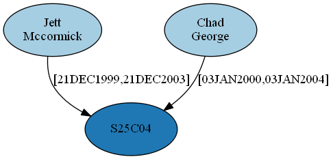
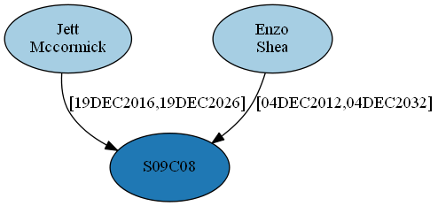
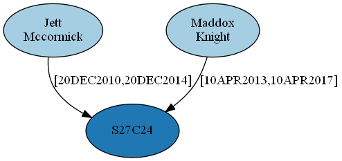
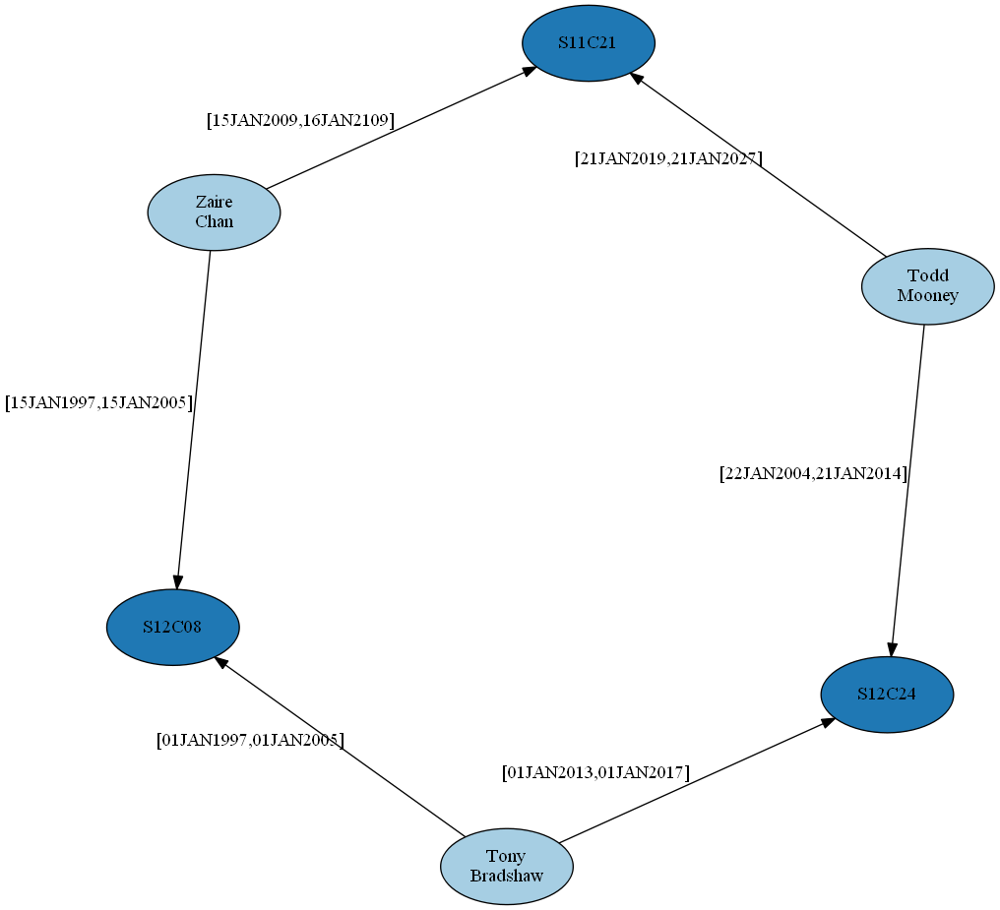
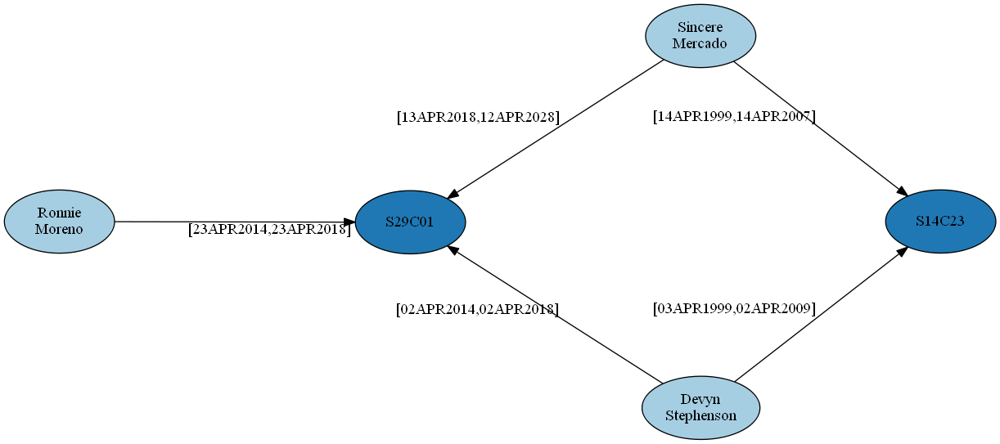
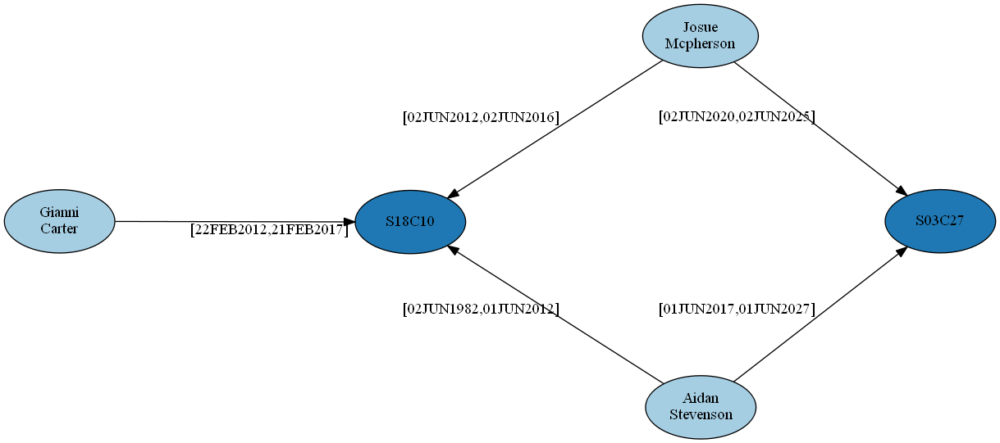
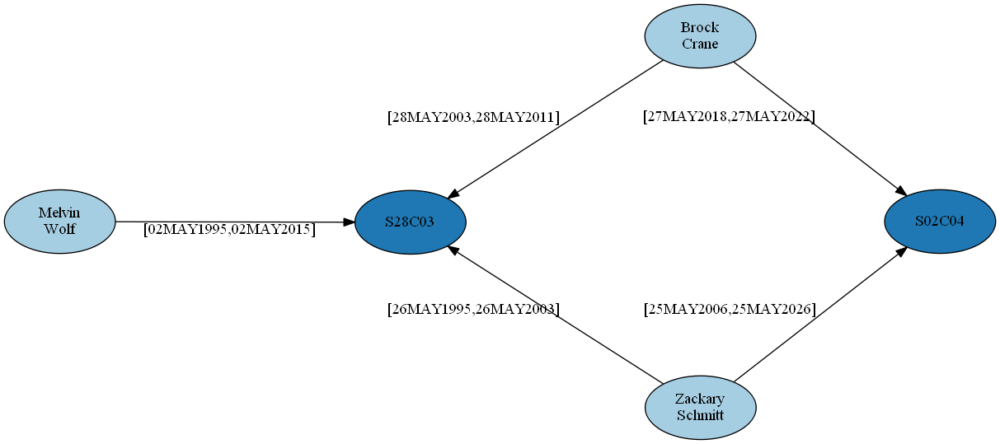
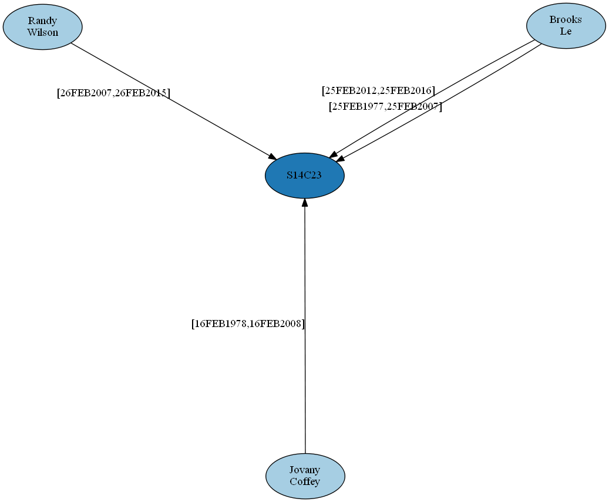
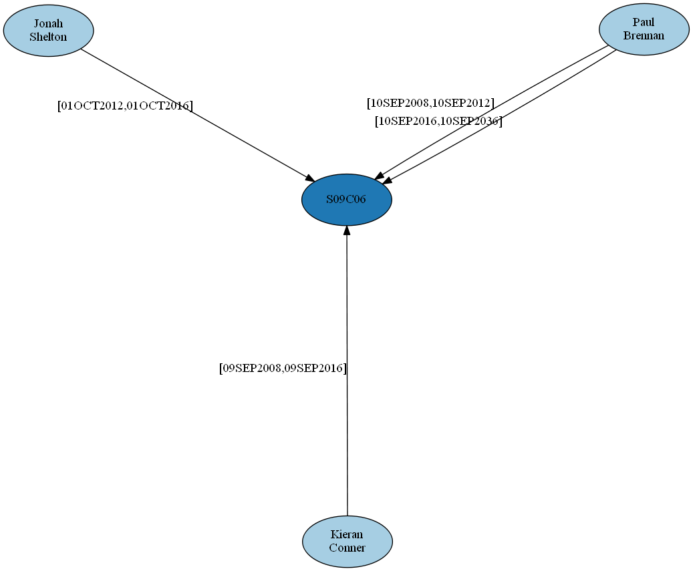
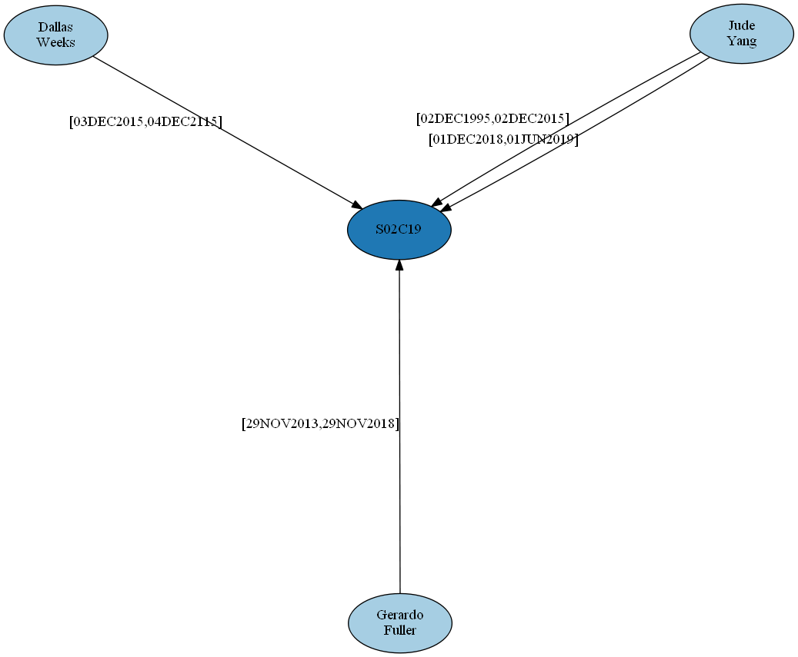

# inmate-network

This demonstration uses PatternMatch to query data from a fictional prison network.

The Data
============

The data used in this demonstration is generated using the script <a href="sas/mockup_inmate_data.sas">mockup_inmate_data.sas</a>. The script simulates a prison population by assigning 40,000 randomly generated inmates to prison cells for sentences of varying length. The length of first-time and repeat inmate sentences are based on the tabulated cumulative density function:

Furthermore, the cells are hierarchically organized into sections, prisons and regions according to the depicted data model:

Based on this data, a number of questions about the data can be answered using PatternMatch queries, which are found in the script <a href="sas/inmate_pattern_matching.sas">inmate_pattern_matching.sas</a>

The first query finds individuals who shared a prison cell with the hypothetical mob boss, Jett Mccormick. The time intervals of cell occupancy must overlap to result in a match. The first three resulting matches are depicted below:

The second query looks for individuals who were in the same section at the same time as Jett Mccormick. Three matches (same section, but different cell) are displayed here:

The third query is more complex. We would like to see which sets of 3 inmates are mutual cell mates. That is, each pair of inmates among the three overlapped in the same cell at some time. Note that the various query keys indicate topologies for multiple ways this could happen. There are seven matches overall.

Query key 0 -- the three inmates overlapped among 3 different cells (1 match found):

Query key 1 -- the three inmates overlapped between 2 different cells (3 matches found):

Query key 3 -- the three inmates overlapped in a single cell (3 matches found):

